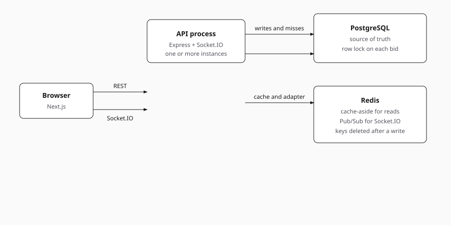
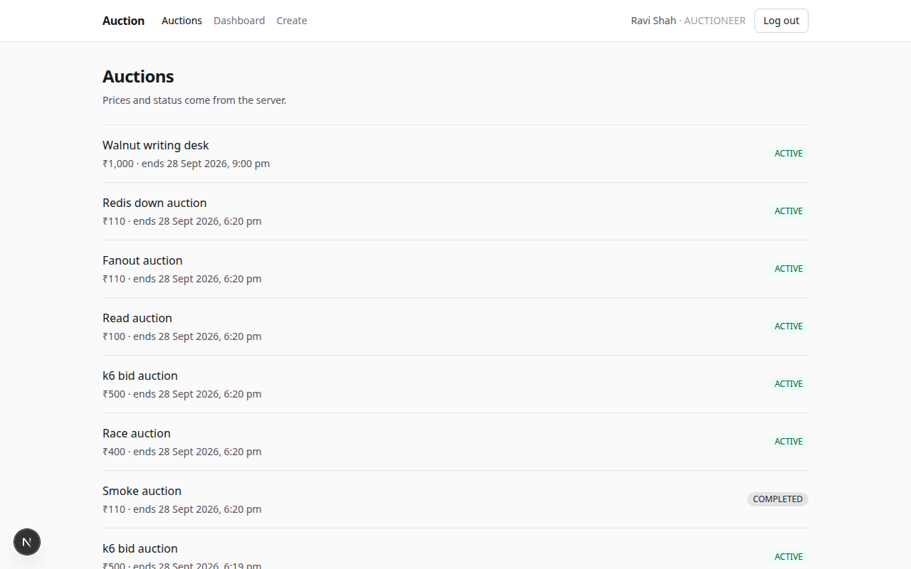
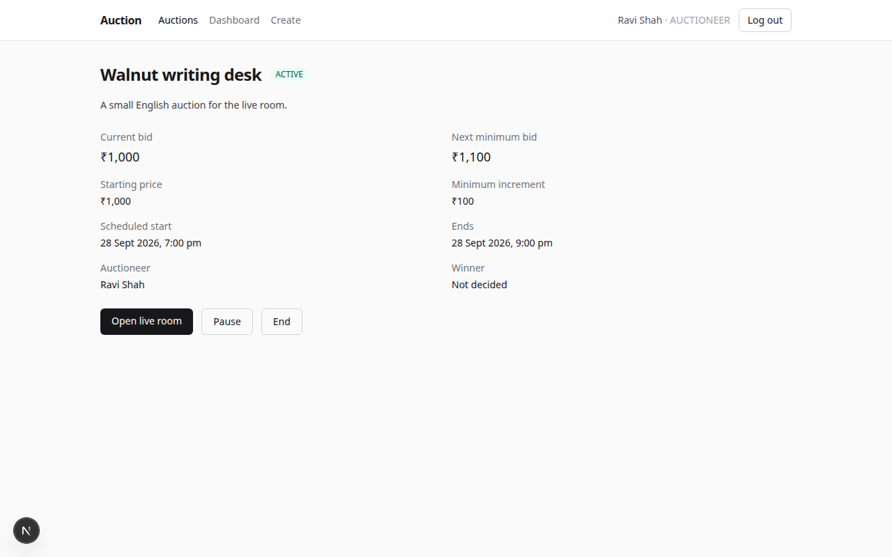
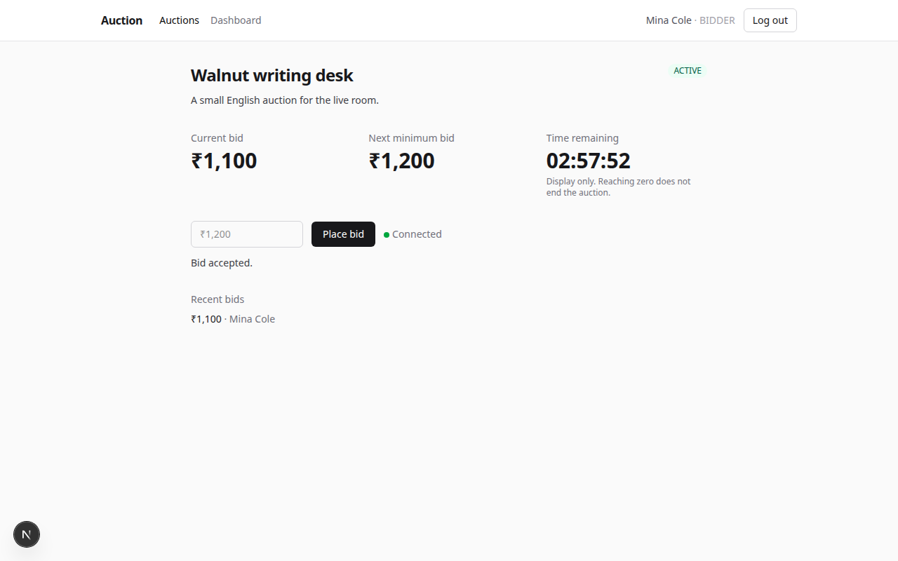
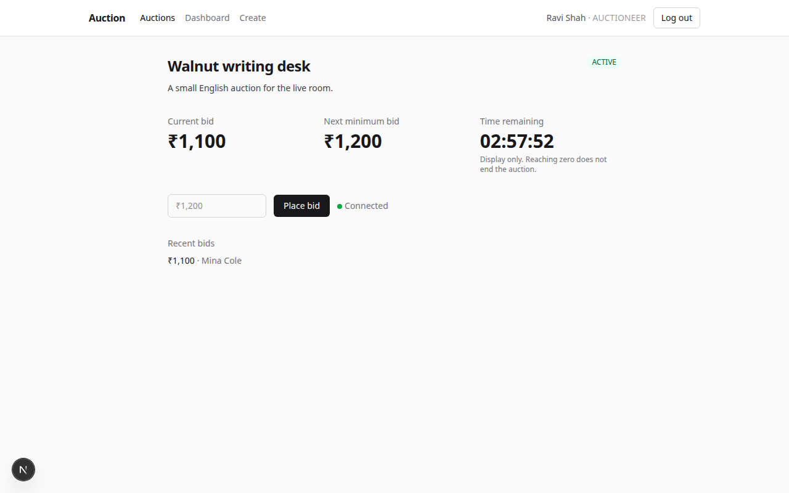
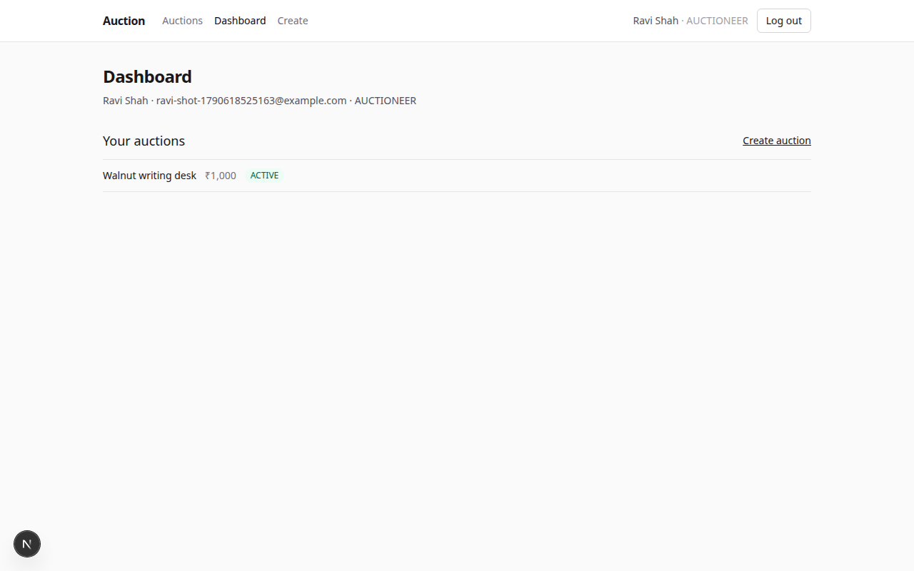

# Real-time auction platform

English ascending auctions. People register, auctioneers open a sale, and bidders compete in a live room. The server decides the price, whether a bid is valid, when the auction ends, and who won. The browser displays that decision. It does not make it.

Money is a PostgreSQL decimal. The API sends it as a string such as `"110.50"`.

## Architecture

One Next.js client and one Express process, or several Express processes that share PostgreSQL and Redis. Prisma is pinned to 6 because Prisma 7 drops `url` from the schema and requires a driver adapter.



```
Browser
  │
  ├── REST ──────────────► Express
  │                         ├── PostgreSQL   source of truth, row lock per bid
  │                         └── Redis        cache-aside
  │
  └── Socket.IO ─────────► Express processes
                            └── Redis Pub/Sub (Socket.IO adapter)
```

| Piece | Role |
| --- | --- |
| Next.js, TypeScript, Tailwind | Listing, details, live room, create, dashboard |
| Express, Socket.IO | HTTP API and auction rooms |
| PostgreSQL, Prisma 6 | Users, auctions, bids |
| Redis, ioredis | Read cache and the Socket.IO adapter |
| Docker Compose | Postgres, Redis, and the API image |
| k6 | HTTP load. Socket.IO checks use `socket.io-client` |
| Vercel and Railway | Intended hosts. Not created from this environment |

## Request flow

1. The browser stores the login token and sends `Authorization: Bearer` on REST calls.
2. A bid is one database transaction. The auction row is locked, the bid is checked, then the bid row and the new price are written together.
3. After commit, the API deletes the Redis keys for that auction and emits `bid:accepted` to room `auction:{id}`.
4. The Socket.IO Redis adapter publishes that emit. Every API process delivers it to its own sockets in the room.
5. Clients already in the room update the price from the event. On connect, including reconnect, the live room joins the room again and loads the auction once. It does not poll.

Listing and detail pages load over REST. Only the live room joins the socket room.

## PostgreSQL is the source of truth

Users, auctions, and bids live in PostgreSQL. A bid is accepted only when the locked row says the auction is `ACTIVE`, the caller is not the owner, `endsAt` is still in the future, and the amount is at least `currentPrice + minimumBidIncrement`. The accepted amount becomes `currentPrice`.

Auction states are `DRAFT`, `SCHEDULED`, `ACTIVE`, `PAUSED`, `COMPLETED`, and `CANCELLED`. Creating an auction with a future start time stores `SCHEDULED`. A start time already in the past stores `DRAFT`. The owner or an admin starts it. Bids are refused until it is `ACTIVE`.

Ending an auction, or reaching `endsAt`, sets the winner to the highest bid. The earlier bid wins a tie. A paused auction whose end time has passed completes instead of resuming.

If Redis is empty, wrong, or down, the next read loads PostgreSQL. A failed cache delete does not roll back the bid.

## Redis cache-aside

Hot reads are the auction list, one auction including its bids, and the bid history.

| Key | TTL | Value |
| --- | --- | --- |
| `cache:auction:{id}` | 60s | Auction detail, including bids |
| `cache:auction:{id}:bids` | 60s | Bid history |
| `cache:auctions:all` | 30s | Unfiltered list |
| `cache:auctions:status:{status}` | 30s | One status |

A miss reads PostgreSQL and stores JSON. A hit returns that JSON and does not read the auction or bid tables. `GET /auctions`, `GET /auctions/:id`, and `GET /auctions/:id/bids` send `X-Cache: HIT` or `X-Cache: MISS`.

After a create, update, bid, or status change commits, those keys are deleted. The TTL only bounds a missed delete. Dashboard routes under `/me` are not cached.

## Redis Pub/Sub and Socket.IO

When `REDIS_URL` is set, the process attaches `@socket.io/redis-adapter` before it listens. Room emits go through Redis Pub/Sub, so a client connected to process B receives a bid accepted on process A.

Events, all after commit:

- `bid:accepted` — bid, current price, next minimum, `endsAt`, and whether anti-sniping extended the auction
- `auction:updated` — start, pause, resume, or cancel
- `auction:completed` — winner and final price

The handshake must carry the same bearer token in `auth.token`. The server checks it before accepting the socket. The client joins with `auction:join`.

Each process schedules its own timer for `endsAt`. That timer is not a one-second poll. Only the transaction that actually changes the row emits `auction:completed`, so two processes do not both announce the same ending.

If Redis is down at startup, the adapter stays off. That process still accepts bids and still emits to its own sockets.

## Concurrent bidding

Two bids can read the same price. If both then write, the lower price can win or two bids can look valid for one step.

Accepting a bid is one transaction:

1. `SELECT ... FOR UPDATE` locks the auction row. Other bids and the completion path wait.
2. Status, price, increment, `endsAt`, and owner are read from that locked row.
3. If `endsAt` has passed, the same transaction marks the auction `COMPLETED`, stores the winner, and the bid is rejected with `AUCTION_EXPIRED`.
4. Otherwise the bid is inserted and `currentPrice` is updated. Anti-sniping changes `endsAt` in that same update.
5. Commit releases the lock. The HTTP response and the socket event both describe that committed result.

There is no sleep and no client-side price check that the server trusts. A bid below the new minimum returns `409 BID_TOO_LOW` and leaves the stored price unchanged.

## Anti-sniping

If a valid bid arrives with `ANTI_SNIPE_WINDOW_SECONDS` or less remaining (default 10), the server adds `ANTI_SNIPE_EXTENSION_SECONDS` (default 10) to `endsAt`. A later valid bid in the new window can extend it again. Set either value to `0` to turn the rule off. The bid response includes `extended` and the authoritative `endsAt`. The socket event carries the same fields.

## Authentication

Public registration creates a `BIDDER` or an `AUCTIONEER`. `ADMIN` is not self-serve. Passwords are hashed with bcrypt cost 12. Login returns an HS256 JWT, `{ sub: userId }`, valid for 7 days. `requireAuth` loads the user from PostgreSQL on each HTTP request. Login and register are limited to 30 requests per 15 minutes per IP. The API trusts one proxy hop so that limit still works behind Railway.

Errors are `{ "success": false, "error": { "code", "message" } }`. Codes include `BID_TOO_LOW`, `AUCTION_NOT_ACTIVE`, `AUCTION_EXPIRED`, `FORBIDDEN`, `UNAUTHORIZED`, and `VALIDATION_ERROR`.

## Why these choices

**PostgreSQL.** A bid has to be consistent with the price, the end time, and the winner. A transaction plus a row lock is the mechanism that serializes two people bidding on the same auction.

**Redis for reads.** Auction pages are read far more often than they are written. Cache-aside keeps those reads off PostgreSQL when nothing has changed.

**Delete the key instead of waiting for the TTL.** A bid changes the price immediately. A 60-second TTL alone would keep serving the old price. The TTL is only a backstop.

**Redis Pub/Sub.** Socket.IO clients are tied to the process that accepted their connection. Pub/Sub, through the Socket.IO adapter, is how a bid on one process reaches clients on another. The cache does not need a second bus: every process deletes the same Redis keys.

**The browser does not decide.** The countdown is display-only. A bid that the server rejects does not change the price on screen except to show the error.

## Deployment

`backend/Dockerfile` builds the API. On start it retries `prisma migrate deploy`, then listens on `PORT`. Compose runs PostgreSQL, Redis, and that image. `GET /health` is the health check.

```bash
docker compose up --build
```

If 5432, 6379, or 4000 are already taken:

```bash
POSTGRES_PORT=5433 REDIS_PORT=6380 BACKEND_PORT=4010 docker compose up --build
```

The intended remote layout is the frontend on Vercel and the API, PostgreSQL, and Redis on Railway. Those hosts were not created here: this environment has no Vercel or Railway credentials, so there is no public URL.

When you do deploy:

- Railway service root directory: `backend`. `backend/railway.toml` selects the Dockerfile and checks `/health`.
- Backend variables: `DATABASE_URL` and `REDIS_URL` from the Railway plugins, a long random `JWT_SECRET`, and `CORS_ORIGIN` set to the Vercel origin with no trailing slash. Do not use `change-me-local-only` outside local Compose.
- Vercel root directory: `frontend`. Set `NEXT_PUBLIC_API_URL` and `NEXT_PUBLIC_SOCKET_URL` to the Railway origin **before** the production build. Next inlines them.
- Use the Vercel origin in the browser as well. `http://127.0.0.1:3000` is a different origin from `http://localhost:3000` and will fail CORS if `CORS_ORIGIN` is localhost.

## Run it locally

Requirements: Node.js 22+, npm, Docker with Compose.

```bash
cp .env.example .env
cp frontend/.env.example frontend/.env.local
docker compose up --build
```

API health: `http://localhost:4000/health`

Frontend, in another terminal:

```bash
cd frontend
npm install
npm run dev
```

Open `http://localhost:3000`. Register an auctioneer, create an auction, press Start, then open the live room from a bidder account. The room shows Connected only after the socket accepts the token.

Without Docker for the API (Postgres and Redis still from Compose):

```bash
docker compose up postgres redis
cd backend
npm install
npx prisma migrate deploy
npm run dev
```

`DATABASE_URL` and `JWT_SECRET` are required. There is no code fallback.

Useful routes:

- `POST /auth/register` and `POST /auth/login` return `{ token, user }`
- `GET /me`, `GET /me/auctions`, `GET /me/bids`
- `GET /auctions`, `POST /auctions`, `GET /auctions/:id`
- `POST /auctions/:id/start|pause|resume|end|cancel`
- `POST /auctions/:id/bids` with `{ "amount": "110.50" }`

## Screens

The live room below is two signed-in browsers on one auction. The bid was placed in the bidder window. The other window received it over Socket.IO.

[Two-window live bidding](docs/two-window-live-bidding.mp4)











## Performance

These are local measurements from 28 September 2026 (UTC), not production benchmarks and not Railway. One API process on port 4000 unless a row says otherwise. Node.js 22.14.0, PostgreSQL 16.15, Redis 7.0.15, k6 1.4.2, 4 vCPU, 16 GB RAM. Postgres and Redis were on localhost.

Re-run with the API on port 4000 and Redis on port 6379:

```bash
node load/run.mjs
```

### Smoke

A `50.00` bid left the price at `100.00`. A `110.00` bid was stored, arrived on Socket.IO, and became the winner when the auction was ended. The first detail read was `X-Cache: MISS` (5.38 ms). The next was `HIT` (1.25 ms).

### Concurrent bidding

Thirty bids from `110.00` through `400.00` were in flight together.

| Result | Value |
| --- | --- |
| Accepted | 24 |
| `BID_TOO_LOW` | 6 |
| Other statuses | 0 |
| Duplicate stored amounts | 0 |
| Final price | `400.00` |

k6 then sent 40 virtual users, one bid each, amounts `110.00` through `500.00`.

| Metric | Value |
| --- | --- |
| Requests/sec | 506.21 over that burst |
| Unexpected error rate | 0 |
| p50 | 55.07 ms |
| p95 | 74.75 ms |
| p99 | 76.44 ms |
| Final price | `500.00` |

The `500.00` bid took the lock first, so it was the only row stored and the other 39 were `BID_TOO_LOW`. That is the lock working, not a dropped write. The requests/sec number is the burst, not a long soak.

### Cached reads

Twenty sequential misses (the detail key was deleted first), then twenty hits. Percentiles are nearest rank, rounded to 0.01 ms.

| | p50 | p95 | p99 |
| --- | --- | --- | --- |
| Miss | 3.17 ms | 3.86 ms | 4.69 ms |
| Hit | 0.78 ms | 0.94 ms | 1.08 ms |

k6 then held 20 virtual users on `GET /auctions/:id` for 20 seconds. Every response was HTTP 200 and `X-Cache: HIT`.

| Metric | Value |
| --- | --- |
| Requests | 180195 |
| Requests/sec | 9009.08 |
| Error rate | 0 |
| p50 | 2.02 ms |
| p95 | 3.17 ms |
| p99 | 4.57 ms |

Hit latency under k6 is higher than the one-at-a-time samples because 20 clients were in flight together.

### Fan-out and Redis down

Ten Socket.IO clients on port 4000 and ten on port 4002 all connected (70.23 ms). All 20 received a `110.00` bid that was posted only to port 4000.

An API pointed at `redis://127.0.0.1:6399` (nothing listening) still returned `201` for a bid. PostgreSQL stored `110.00`. A socket on that same process received it. The following read was `X-Cache: MISS`. That process could not fan out to other processes.

## Known limitations

- There is no public Vercel or Railway deployment yet.
- The live room is the only page that receives pushes. The list and the details page stay on the REST response until reload.
- The on-screen countdown does not close the auction. The server does, on the end timer or on the next read or bid that finds `endsAt` in the past.
- Cache-aside can briefly store a stale value if a read that started before a write finishes its `SET` after the write's `DEL`. The TTL bounds that window.
- `/me` is not cached. Each authenticated HTTP call also reads the user row.
- k6 does not speak Socket.IO, so fan-out was measured with `socket.io-client`.
- One CORS origin. It must match the page origin exactly.
- No payments, search engine, or second database.

## Checks

```bash
cd backend && npm run typecheck && npm run lint && npm run build
cd frontend && npm run lint && npm run build
node load/run.mjs
```
